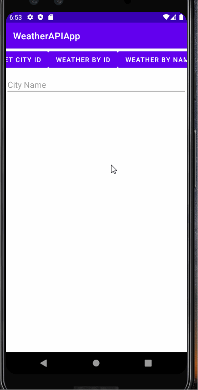

# WeatherAPIApp

**WeatherAPIApp** is an android app created with Java that handles JSON data from a REST API service called MetaWeather. The app uses the Volley library to create a weather app using API data.
Here is a link to the API: https://www.metaweather.com/api/.

Submitted by: **Sean Westbrook**

Time spent: **5** hours spent in total

The following code is completed:

* [x] Building a RequestQueue
* [x] Designing a Singleton
* [x] Using callbacks for async network communications
* [x] Using the Volley library methods JsonArrayRequest and JsonArrayObject to parse a JSON file.

## User Stories

## Video Walkthrough

Here's a walkthrough of implemented user stories:

GIF created with [LiceCap](http://www.cockos.com/licecap/).

## Notes

Learned the basics of data persistence, the MVC pattern, and implementing RecyclerView. Used Java code to manage the data model and adapter.
